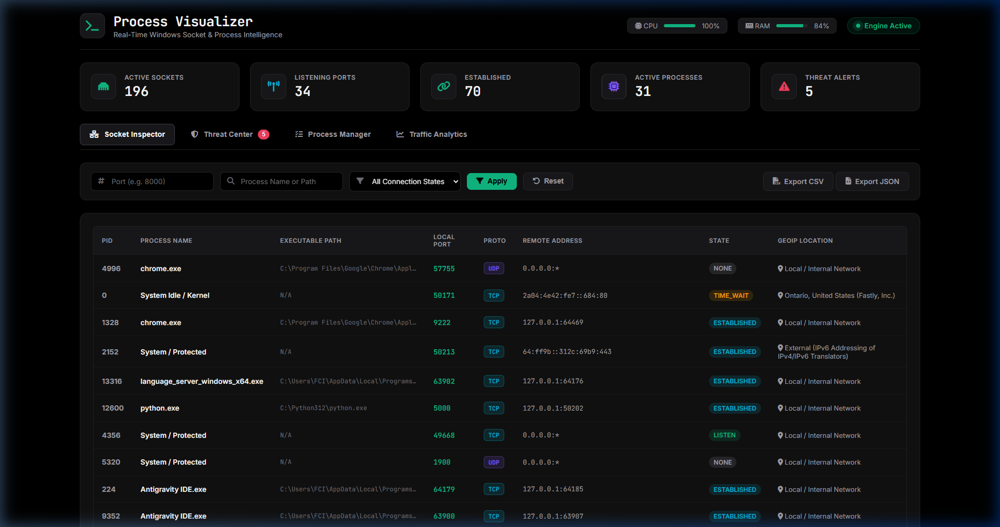

<div align="center">

# ⚡ Process Visualizer 🛡️

### **Real-Time Cross-Platform Network Socket & Process Intelligence Engine**

[](LICENSE)
[](https://www.python.org/)
[](#-cross-platform-support)
[](#-contributing)
[](#-production-execution)

---

[Key Features](#-key-features) &bull; [Dashboard Preview](#-dashboard-preview) &bull; [How It Works](#-how-it-works) &bull; [Quick Start](#-quick-start) &bull; [Documentation](#-project-documentation) &bull; [API Docs](#-rest-api-reference) &bull; [Author](#-author--contact)

</div>

---

## 📸 Dashboard Preview



---

## 📖 About The Project

**Process Visualizer** is an open-source, high-performance network security and process inspection tool engineered for **Windows** and **Linux** environments.

It bridges low-level system socket telemetry with real-time threat intelligence, providing security analysts, network engineers, and system administrators with a high-contrast **Black & Hacker Grey Operations Dashboard**.

---

## ⚙️ How It Works

```text
┌─────────────────────────────────────────────────────────────┐
│                 System Sockets & Telemetry                  │
│             (Windows psutil / Linux /proc /net)             │
└──────────────────────────────┬──────────────────────────────┘
                               │ (5s Telemetry Scan)
                               ▼
┌─────────────────────────────────────────────────────────────┐
│            Process Visualizer Core Backend                  │
│       (Threat Engine, Alert Loggers & LRU GeoIP)            │
└──────────────────────────────┬──────────────────────────────┘
                               │ (Atomic WAL Transactions)
                               ▼
┌─────────────────────────────────────────────────────────────┐
│           SQLite WAL Database (port_activity.db)            │
└──────────────────────────────┬──────────────────────────────┘
                               │
                               ▼
┌─────────────────────────────────────────────────────────────┐
│        Waitress WSGI Production Engine (8 Threads)          │
└──────────────────────────────┬──────────────────────────────┘
                               │ (REST JSON APIs)
                               ▼
┌─────────────────────────────────────────────────────────────┐
│        Process Visualizer Hacker Dashboard (UI)             │
└──────────────────────────────┬──────────────────────────────┘
                               │
       ┌───────────────────────┼───────────────────────┐
       ▼                       ▼                       ▼
┌──────────────┐       ┌──────────────┐       ┌──────────────┐
│   Socket     │       │   Threat     │       │   Process    │
│  Inspector   │       │   Center     │       │   Manager    │
└──────────────┘       └──────────────┘       └──────────────┘
```

1. **Telemetry Collection Loop**: Every 5 seconds, a background collector thread queries OS network sockets (`psutil.net_connections()`) and active processes (`psutil.Process()`).
2. **Resource & GeoIP Telemetry**: Extracts PID, Process Name, Executable Path, User Account, CPU %, Memory RSS (MB), and maps remote IP locations via an in-memory LRU GeoIP cache.
3. **Threat Inspection Engine**: Automatically checks each connection against threat rules (restricted low ports <1024, known backdoor ports like 4444/31337, and foreign remote connections).
4. **SQLite WAL Persistence**: Writes socket snapshots, process inventory, and security alerts atomically into `port_activity.db` using SQLite Write-Ahead Logging (`WAL`).
5. **Real-Time UI Updates**: The multi-tab Black & Hacker Grey frontend fetches live data via REST APIs, updating socket tables, metrics, timeline line graphs, protocol donut charts, and alert feed popups dynamically every 5 seconds.

---

## ✨ Key Features

* ⚡ **Live Real-Time Telemetry**: Continuously tracks active network connections, listening ports, established sockets, and running processes using `psutil`.
* 🖤 **Black & Hacker Grey Dashboard**: Sleek, high-contrast dark theme with matrix green (`#10b981`) and neon cyan (`#06b6d4`) visual indicators.
* 🛡️ **Automated Threat Detection Engine**: Automatically flags restricted low-port bindings (<1024), known backdoor/trojan ports (4444, 6667, 31337, etc.), and suspicious foreign connections.
* 💾 **SQLite WAL High-Concurrency Storage**: Utilizes Write-Ahead Logging (`PRAGMA journal_mode=WAL;`) with thread locking and automated 7-day data retention pruning.
* 🌐 **Multi-Threaded Production WSGI Engine**: Powered by **Waitress** WSGI server (`threads=8`) for multi-threaded Windows & Linux production deployment.
* 📍 **Smart LRU GeoIP Lookup**: Automatically classifies local/private subnets (`127.0.0.1`, `10.x.x.x`, `192.168.x.x`, `172.16-31.x.x`) locally and caches external IP lookups via `ip-api.com`.
* 📤 **Filtered Data Export**: Download live activity logs in standard **CSV** or **JSON** formats.

---

## 📚 Project Documentation

For comprehensive technical architecture, database schemas, threat rule engine specifications, and API documentation, please refer to the formal [**PROJECT_DOCUMENTATION.md**](PROJECT_DOCUMENTATION.md) file.

---

## 🌐 Cross-Platform Support

| Feature | Windows | Linux | Requirements |
| :--- | :---: | :---: | :--- |
| **Socket Telemetry** | ✅ | ✅ | Admin Prompt (Windows) / `sudo` (Linux) for complete PID resolution |
| **WSGI Server** | ✅ (Waitress) | ✅ (Waitress / Gunicorn) | Multi-threaded Waitress WSGI included |
| **Database Engine** | ✅ | ✅ | SQLite WAL mode works natively on all OSes |
| **Daemon Whitelist** | ✅ | ✅ | Whitelists daemons (`sshd`, `nginx`, `apache2`) and services (`svchost.exe`, `lsass.exe`) |

---

## ⚡ Quick Start

### 1. Prerequisites
- **Python**: 3.8 or higher
- **Permissions**: Administrator privileges (Windows Elevated PowerShell) or Root (`sudo` on Linux)

### 2. Installation

```bash
# Clone the repository
git clone https://github.com/chandugollavilli/PortProcessVisualizer.git
cd PortProcessVisualizer

# Install dependencies
pip install -r requirements.txt
```

### 3. Run Production Server

#### Windows (Elevated PowerShell):
```powershell
python run_production.py
```

#### Linux (Terminal):
```bash
sudo python3 run_production.py
```

Open your browser and navigate to: **[http://127.0.0.1:5000](http://127.0.0.1:5000)**

---

## 🔌 REST API Reference

| Endpoint | Method | Description |
| :--- | :--- | :--- |
| `/api/data` | `GET` | Fetches active sockets, CPU/RAM metrics, and timeline data. Query params: `port`, `process`, `status`, `protocol`. |
| `/api/alerts` | `GET` | Returns active security threat alerts. Filter by `status` (`ACTIVE` or `ACKNOWLEDGED`). |
| `/api/alerts/acknowledge/<id>` | `POST` | Acknowledges and dismisses a security threat incident. |
| `/api/processes` | `GET` | Retrieves full running process inventory with PID, EXE path, username, CPU %, RAM MB, and socket counts. |
| `/api/export/csv` | `GET` | Exports socket activity logs to CSV format. |
| `/api/export/json` | `GET` | Exports socket activity logs to JSON format. |

---

## 🛡️ Threat Detection Rules

1. **Privileged Port Binding (`CRITICAL`)**: Non-system process binding to restricted ports below 1024.
2. **Known Threat Port (`CRITICAL`)**: Socket binding to known reverse shell/trojan ports (e.g., `4444` Metasploit, `6667` IRC botnet, `31337` Back Orifice, `1337` LEET, `5555` ADB debug).
3. **Unusual Remote Connection (`WARNING`)**: Active outbound connection (`ESTABLISHED`) to non-standard remote IP addresses.

---

## 🤝 Contributing

Contributions are welcome! Please follow these steps:
1. **Fork the Project** (`https://github.com/chandugollavilli/PortProcessVisualizer/fork`)
2. **Create your Feature Branch** (`git checkout -b feature/AmazingFeature`)
3. **Commit your Changes** (`git commit -m 'Add some AmazingFeature'`)
4. **Push to the Branch** (`git push origin feature/AmazingFeature`)
5. **Open a Pull Request**

---

## 📜 License

Distributed under the MIT License. See [`LICENSE`](LICENSE) for details.

---

## 👨‍💻 Author & Contact

**Chandu Gollavilli**

* **Email**: [chandugollavilli@gmail.com](mailto:chandugollavilli@gmail.com)
* **LinkedIn**: [https://www.linkedin.com/in/chandragollavilli/](https://www.linkedin.com/in/chandragollavilli/)
* **Project Link**: [https://github.com/chandugollavilli/PortProcessVisualizer](https://github.com/chandugollavilli/PortProcessVisualizer)
